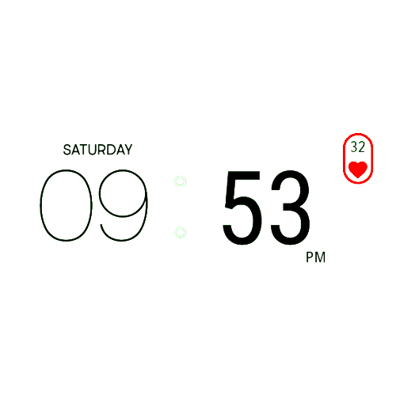

# TextClockWidget
I am Raj And I have Created this Widget for Daily Purposes Its Like a Normal type Widget but Its UI is Awesome, its Showing Time of Hours Minutes and Seconds Format = (hh:mm:ss + a + cccc and dd/mm/yyyy). Its Having An Easter Egg While Clicking on Heart / Seconds or on Am / Pm. Its Have 20 Different Styles of Widget inside one App.

## APK Download
* [TextClockWidget v1.0](https://github.com/rajprajapati2001/TextClockWidget/raw/refs/heads/master/TextClock%20Widget_1.0.apk) - (4.6 MB)
* [TextClockWidget v1.1](https://github.com/rajprajapati2001/TextClockWidget/raw/refs/heads/master/app/release/app-release.apk) - (10.7 MB)

## UI Designs

## About
>Developed By : `Raj P. Prajapati` on `06th June 2022 `/` Monday`.

## Screenshots

